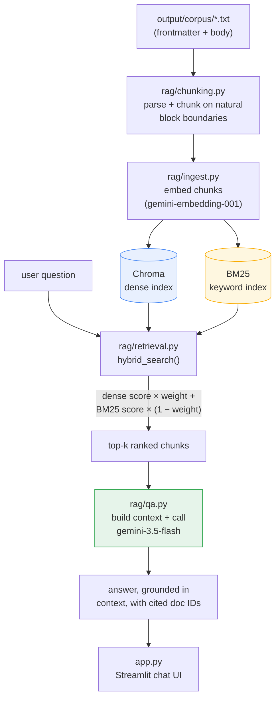

# Londiani Worshippers RAG

A retrieval-augmented question-answering system for a church's internal records — sermons, board minutes, choir schedules, counseling summaries — answerable through actual questions instead of grepping through files. Hybrid retrieval (dense + BM25) is combined and generation is grounded strictly in what's retrieved, with a labeled evaluation set to catch retrieval regressions instead of eyeballing chat outputs.

**Live demo:** [add your Streamlit Cloud URL]

## Why this project

- **Hybrid retrieval, tuned deliberately**: dense (Gemini embeddings) + BM25,
  combined with a configurable weight, because dense search alone misses
  exact-ID and exact-number queries, and BM25 alone misses paraphrase/semantic ones.
- **Evaluation-driven, not vibes-driven**: `rag/evaluate.py` runs labeled
  queries against the index and checks expected doc IDs land in top-k — this
  is what caught the BM25 tokenization bug described below, before it reached
  the UI.
- **Chunking strategy shaped by the corpus**, not a fixed token count: most
  documents are short enough to embed whole; only outliers get split, and
  only on natural boundaries (a motion, an agenda item, a lesson section),
  so nothing meaningful is ever cut mid-way.
- **Grounded generation**: the system prompt answers only from retrieved
  context and says so plainly when the context doesn't cover the question,
  citing source doc IDs rather than inventing plausible-sounding history.
- **Handles a flaky external API like production code**: retry-with-backoff
  on both embedding rate limits (429) and generation-endpoint overload (503).

## Architecture



## Tech stack

- **Embeddings:** `gemini-embedding-001`, truncated to 768 dims (Matryoshka representation)
- **Generation:** `gemini-3.5-flash`
- **Vector store:** Chroma (local, persisted, committed straight into the repo — the corpus is small enough that a hosted vector service felt like an unnecessary moving part)
- **Keyword search:** `rank_bm25`
- **UI:** Streamlit

## How retrieval works

Chunking took more thought than expected. Almost every document here is short — a page or less — so splitting them would just water down retrieval for no reason. Short docs stay whole; only the longer outliers (a handful of board minutes, bible studies, counseling summaries) get split, and only along their natural item breaks, so a single motion or lesson section never gets cut in half.

The part that actually caused a bug: tracking IDs like `LW-0031` only live in each file's frontmatter, never in the body text. First pass at searching "what's in LW-0031?" came back empty, which made no sense until I checked what was actually being indexed. Fixed it by folding the doc_id into what gets tokenized for BM25. Dense search still does the semantic heavy lifting; BM25 catches the exact-ID and exact-number cases dense embeddings tend to smear over.

`rag/evaluate.py` runs a small labeled query set against the live index — each case pairs a query with the doc ID or category it should surface in top-k — plus a dense-vs-BM25 comparison on an exact-ID query, to make sure that regression stays caught. It's a fast smoke test rather than a rigorous benchmark (no recall@k / MRR over a large labeled set); a natural next step would be expanding it into a proper eval set with graded relevance judgments.

## Running locally

```bash
export GEMINI_API_KEY=your-key-here
python3 -m rag.ingest        # build the Chroma + BM25 index from output/corpus
python3 -m rag.evaluate      # optional: check retrieval quality
streamlit run app.py
```

Full setup (getting a key, wiring the GitHub Action, deploying on Streamlit) is in [`rag/SETUP.md`](rag/SETUP.md).

## The corpus

The records answered over are synthetic: 225 documents across 15 categories (sermons, board minutes, tithe reports, counseling intake, choir schedules, and so on), generated programmatically for the fictional "Londiani Worshippers" church, with Kenyan place names, local context, and occasional Swahili phrases mixed in. A uniqueness tracker avoids near-duplicate openings/closings across documents, and a validation pass (document/category counts, ID uniqueness, required fields, timestamp ranges, minimum length, no exact duplicates) runs before anything is written to disk.

Generation and export are handled by `dataset_generator/` and `generate_dataset.py` / `export_corpus.py` — see the generator modules under `dataset_generator/generators/` if you want to adapt this to a different domain or document set.

## Continuous integration

Two chained GitHub Actions workflows: a push to `main` regenerates the dataset (`generate_dataset.yml`), which on completion triggers a second workflow (`build_rag_index.yml`) that rebuilds the vector + BM25 index, runs the retrieval smoke tests, and commits the result back into the repo — so the deployed app always serves an index built from the latest committed corpus.
